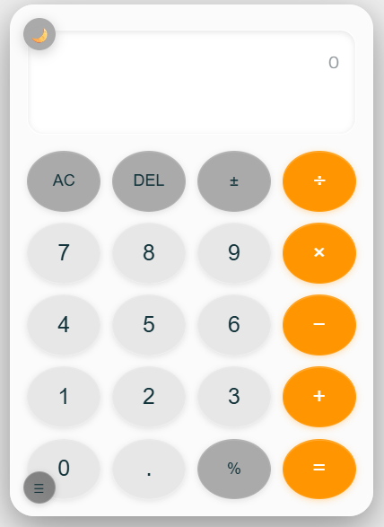
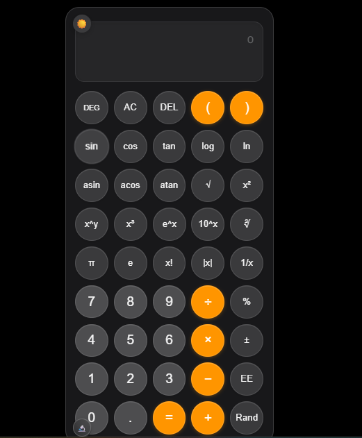
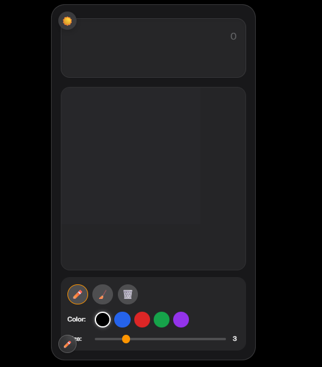

# 🧮 iPhone-Style Calculator

A fully responsive, feature-rich calculator web application inspired by the iOS calculator design. Built with HTML, CSS, and JavaScript, featuring three distinct modes: Basic, Scientific, and Math Notes.


## ✨ Features

### 🎯 Three Calculator Modes

1. **Basic Mode** - Standard arithmetic operations
   - Addition, subtraction, multiplication, division
   - Percentage calculations
   - Decimal point support
   - Clear (AC) and Delete (DEL) functions
   - Plus/minus toggle (±)

2. **Scientific Mode** - Advanced mathematical functions
   - Trigonometric functions: sin, cos, tan, asin, acos, atan
   - Logarithmic functions: log, ln, log₂
   - Exponential functions: eˣ, 10ˣ, xʸ, x², x³
   - Root functions: √x, ∛x
   - Mathematical constants: π (pi), e (Euler's number)
   - Factorial, absolute value, and more
   - Degree/Radian mode toggle
   - Memory functions: MC, MR, M+, M-
   - Parentheses for complex expressions

3. **Math Notes Mode** - Interactive drawing canvas
   - Draw and write with touch or mouse
   - Multiple pen colors
   - Adjustable stroke width
   - Eraser tool
   - Clear canvas option

### 🎨 Design Features

- **Glassmorphism UI** - Modern frosted glass effect matching iOS design
- **Dark/Light Theme** - Toggle between themes with smooth transitions
- **iPhone-Inspired Layout** - Authentic iOS calculator aesthetic
- **Smooth Animations** - Hover effects, button press animations, and transitions
- **Circular Buttons** - Clean, modern button design
- **Color-Coded Operations** - Visual distinction between numbers, functions, and operators

### 📱 Fully Responsive

- **Mobile Phones** (Portrait & Landscape) - Optimized for small screens
- **Tablets** - Perfect layout for medium-sized devices
- **Desktops** - Centered design with optimal sizing
- **Touch-Friendly** - Minimum 44px touch targets for accessibility

## 🚀 Demo

[Live Demo](#) _(Add your GitHub Pages link here)_

## 📸 Screenshots

### Basic Mode - Light Theme


### Scientific Mode - Dark Theme


### Math Notes Mode


## 🛠️ Technologies Used

- **HTML5** - Semantic markup
- **CSS3** - Modern styling with CSS Grid, Flexbox, and custom properties
- **JavaScript (ES6+)** - Calculator logic and interactive features
- **Canvas API** - Drawing functionality for Math Notes mode

## 📦 Installation

1. Clone the repository
```bash
git clone https://github.com/Muhammad-bilal-503/iOS-calculator.git
```

2. Navigate to the project directory
```bash
cd iphone-calculator
```

3. Open `index.html` in your browser
```bash
# On macOS
open index.html

# On Windows
start index.html

# On Linux
xdg-open index.html
```

Or simply drag and drop `index.html` into your browser.

## 💻 Usage

### Basic Mode
1. Click numbers and operators to build expressions
2. Press `=` to evaluate
3. Use `AC` to clear all or `DEL` to delete last character
4. Toggle `±` to change sign
5. Use `%` for percentage calculations

### Scientific Mode
1. Click the mode button (bottom-left corner) to switch to Scientific mode
2. Use advanced functions like sin, cos, tan, log, ln, etc.
3. Toggle between DEG/RAD for trigonometric calculations
4. Use memory functions (M+, M-, MR, MC) for complex calculations
5. Use parentheses for nested expressions

### Math Notes Mode
1. Click the mode button twice to enter Math Notes mode
2. Select a pen color from the color palette
3. Adjust stroke width as needed
4. Draw or write on the canvas with mouse or touch
5. Use eraser to remove specific parts
6. Click "Clear" to reset the canvas

### Theme Toggle
- Click the sun/moon icon in the top-left corner to switch between light and dark themes

## 📁 Project Structure

```
iphone-calculator/
│
├── index.html          # Main HTML file
├── styles.css          # CSS styles (included in HTML)
├── script.js           # JavaScript logic (included in HTML)
├── README.md           # Project documentation
└── screenshots/        # Screenshots for README
    ├── basic-light.png
    ├── scientific-dark.png
    └── math-notes.png
```

## 🎯 Key Features Breakdown

### Responsive Design
- Viewport-based widths with max-width constraints
- CSS Grid with automatic space distribution
- Media queries for breakpoints: 480px, 768px, 1024px+
- Flexible button sizing that adapts to screen size
- Touch-friendly minimum 44px tap targets

### Glassmorphism Effects
```css
backdrop-filter: blur(20px);
background: rgba(255, 255, 255, 0.1);
border: 1px solid rgba(255, 255, 255, 0.2);
box-shadow: 0 8px 32px rgba(0, 0, 0, 0.1);
```

### Theme System
- CSS custom properties for easy theme switching
- Smooth 0.3s transitions between themes
- Persistent visual consistency across all modes

### Calculator Logic
- Proper order of operations (PEMDAS)
- Error handling for invalid operations
- Support for complex nested expressions
- Scientific notation support

## 🔧 Customization

### Change Colors
Edit the CSS custom properties in the `:root` section:
```css
:root {
    --bg-dark: #000000;
    --bg-light: #f5f5f5;
    --operator-color: #FF9500;
    /* etc. */
}
```

### Modify Button Layout
Adjust the CSS Grid configuration:
```css
.calculator-buttons {
    grid-template-columns: repeat(4, 1fr);
    gap: 12px;
}
```

### Add New Functions
1. Add button in HTML
2. Add styling in CSS
3. Implement logic in JavaScript event listeners

## 🐛 Known Issues

- None currently! 🎉


## 📝 License

This project is licensed under the MIT License - see below for details:


MIT License

Copyright (c) 2025 [Your Name]

Permission is hereby granted, free of charge, to any person obtaining a copy
of this software and associated documentation files (the "Software"), to deal
in the Software without restriction, including without limitation the rights
to use, copy, modify, merge, publish, distribute, sublicense, and/or sell
copies of the Software, and to permit persons to whom the Software is
furnished to do so, subject to the following conditions:

The above copyright notice and this permission notice shall be included in all
copies or substantial portions of the Software.

THE SOFTWARE IS PROVIDED "AS IS", WITHOUT WARRANTY OF ANY KIND, EXPRESS OR
IMPLIED, INCLUDING BUT NOT LIMITED TO THE WARRANTIES OF MERCHANTABILITY,
FITNESS FOR A PARTICULAR PURPOSE AND NONINFRINGEMENT. IN NO EVENT SHALL THE
AUTHORS OR COPYRIGHT HOLDERS BE LIABLE FOR ANY CLAIM, DAMAGES OR OTHER
LIABILITY, WHETHER IN AN ACTION OF CONTRACT, TORT OR OTHERWISE, ARISING FROM,
OUT OF OR IN CONNECTION WITH THE SOFTWARE OR THE USE OR OTHER DEALINGS IN THE
SOFTWARE.


## 👨‍💻 Author

**Your Name**
- GitHub: [@Muhammad-bilal-503](https://github.com/Muhammad-bilal-503)
- LinkedIn: [Muhammad Bilal](www.linkedin.com/in/muhammad-bilal-aa5364344)
- Email: mughalbillal0012345@gmail.com

## 🙏 Acknowledgments

- Design inspired by Apple's iOS Calculator
- Glassmorphism design trends
- iPhone calculator UI/UX principles

## 📊 Browser Support

| Browser | Version | Supported |
|---------|---------|-----------|
| Chrome  | 90+     | ✅        |
| Firefox | 88+     | ✅        |
| Safari  | 14+     | ✅        |
| Edge    | 90+     | ✅        |
| Opera   | 76+     | ✅        |

## 🔮 Future Enhancements

- [ ] History/calculation log
- [ ] Keyboard shortcuts
- [ ] Copy/paste support
- [ ] Export Math Notes drawings
- [ ] More themes (custom color schemes)
- [ ] Unit converter
- [ ] Currency converter
- [ ] Save calculator state

## 📞 Support

If you found this project helpful, please give it a ⭐️!

For support, email mughalbillal0012345@gmail.com or open an issue in the repository.

---

**Made with ❤️ and JavaScript**
